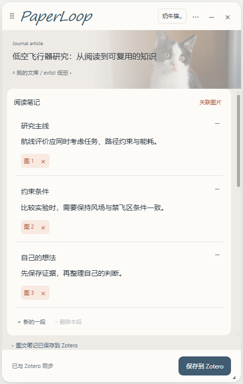
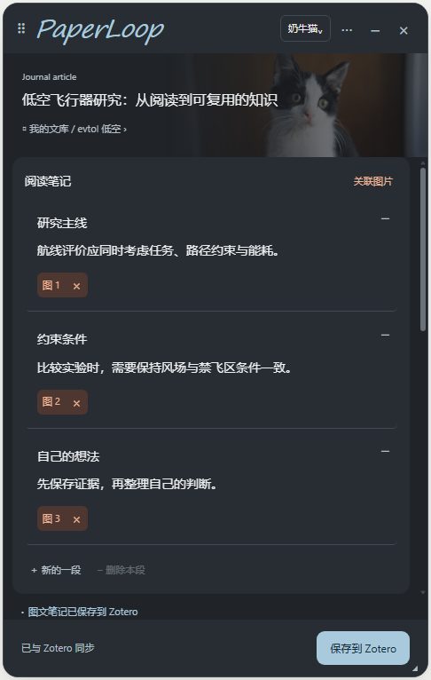
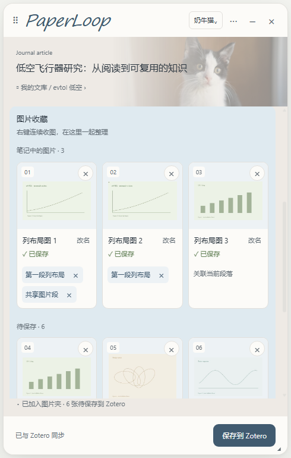

[English](README.md) | [简体中文](README.zh-CN.md)

# PaperLoop

Keep reading. Capture text and images. Save the paper and your notes to Zotero.

PaperLoop adds a reading notebook to Zotero Connector's metadata and attachment workflow. Collect webpage images with a right-click, write alongside the paper, and save both to a Zotero child note.

## Interface preview

Screenshots of the actual browser interface with isolated demo content.

| Light theme | Dark theme | Image collection |
| --- | --- | --- |
|  |  |  |

## What's new

Browser extension **0.3.28** · Zotero plugin **0.5.4**

- Browser and Zotero edits now sync to the same note. Changes to different paragraphs merge automatically.
- Fixed false “versions differ” warnings after ordinary edits.
- Saved image thumbnails appear when reopening a paper with multiple images.

[Full release notes / 更新说明](docs/releases/v0.3.28.md)

## Download and install

1. Download the [complete share package](https://github.com/jinkeguo/PaperLoop/releases/download/v0.3.28/PaperLoop-0.3.28-Share.zip), or get the [browser extension 0.3.28](https://github.com/jinkeguo/PaperLoop/releases/download/v0.3.28/PaperLoop-Browser-Extension-0.3.28.zip) and [Zotero plugin 0.5.4](https://github.com/jinkeguo/PaperLoop/releases/download/v0.3.28/PaperLoop-for-Zotero-0.5.4.xpi) separately.
2. Install the XPI through Zotero's Plugins manager and restart Zotero.
3. Extract the browser ZIP, open Edge/Chrome's extensions page, enable developer mode, and load the folder containing `manifest.json`.

Already using PaperLoop? Keep the existing browser extension directory, replace its files, reload the extension, and refresh open webpages. Install Zotero plugin 0.5.4 if needed.

[Installation and upgrade guide](docs/INSTALLATION.md) · [Latest release](https://github.com/jinkeguo/PaperLoop/releases/latest)

## Source and development

- [`browser-extension/`](browser-extension): current loadable browser code and local assets, version 0.3.28.
- [`zotero-plugin/`](zotero-plugin): current Zotero plugin source, version 0.5.4.
- [Build and test](docs/BUILD_AND_TEST.md): packaging and regression checks for this release.
- The original `src/`, `lib/`, `paperloop-zotero-bridge/` and upstream build scripts are retained as the historical 0.3.11 development baseline; they are not the current release entry point.

## Documentation

- [Changelog](CHANGELOG.md)
- [Credits](docs/CREDITS.md)
- [Privacy](docs/PRIVACY.md)
- [Architecture baseline](docs/ARCHITECTURE.md)
- [Contributing](CONTRIBUTING.md)
- [Earlier 0.3.11 workflow demo](https://github.com/jinkeguo/PaperLoop/releases/download/v0.3.11/PaperLoop-0.3.11-demo.mp4)

## About

PaperLoop is an independent modified distribution of [Zotero Connector](https://github.com/zotero/zotero-connectors), not an official Zotero product. It retains the supplied translator and extraction pipeline. Website capture and full-text access depend on the site's translator and your access permissions.

The current release was checked with Microsoft Edge and Zotero 9.0.6. See [build and test](docs/BUILD_AND_TEST.md) for verification details.

Code is distributed under AGPLv3; see [COPYING](COPYING) and [NOTICE.md](NOTICE.md). Theme image sources and their separate licenses are recorded in [SOURCES.md](browser-extension/images/paperloop-themes/SOURCES.md).
