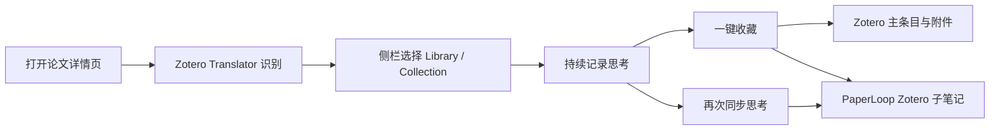

# PaperLoop

PaperLoop 是一个面向论文阅读流程的实验性工具：在论文网页旁持续记录思考，选择 Zotero 文库/分类后，一键用 Zotero Translator 保存可信题录和附件，并把思考写成该条目下可持续更新的 Zotero 子笔记。

当前发布组合：

- PaperLoop for Zotero Connector `0.3.10`
- PaperLoop DOI Bridge for Zotero 7 `0.1.19`

> 本项目是 Zotero Connector 的修改分支，不是 Zotero 官方产品，也未获得 Zotero 官方背书。

## 核心能力

- 可拖动、可最小化的常驻阅读侧栏，不阻塞论文页面滚动；
- 同一标签页切换论文自动刷新，多标签页各自保留侧栏和草稿；
- 使用 Zotero 官方/社区 Translator 获取题录，不用视觉猜测补齐残缺元数据；
- 在侧栏中选择 Zotero Library 和 Collection，一次确认完成收藏；
- DOI 去重、重复点击幂等、同一文库多 Collection 复用同一主条目；
- 思考直接进入 Zotero 子笔记，后续同步更新同一笔记；
- 浏览器缓存丢失时，按 DOI 从 Zotero 恢复条目和 PaperLoop 笔记关联；
- 已有条目缺 PDF 时可再次尝试补录，并拒绝把 HTTP 200 的 HTML 登录页伪装成 PDF。

## 使用流程

Agent 或大模型 API 不参与题录识别、收藏、去重和笔记写入的可靠主链路。未来可把 Agent 用于摘要、问答和写作辅助，但不能代替 Zotero 成为文献数据源。

## 安装

从 GitHub Release 下载浏览器扩展 ZIP 和 Zotero Bridge XPI，然后按 [安装与验收说明](docs/INSTALLATION.md) 操作。浏览器扩展目前是开发者模式加载的测试版，不能直接把 ZIP 当作“已解压扩展”安装。

## 兼容性与状态

| 组件 | 已验证环境 | 状态 |
|---|---|---|
| 浏览器扩展 | Microsoft Edge / Chromium，Manifest V3 | 0.3.10 |
| Zotero Bridge | Zotero 7.0.x | 0.1.19 |
| ScienceDirect | 登录态真实论文页 | Translator、思考、已有条目补 PDF 链路已测试 |
| CNKI / 万方 | 固定社区 Translator | 题录依赖页面结构；PDF 依赖登录和机构权限 |

自动化回归覆盖 DOI 去重、并发/重复点击、分类、跨 Library、笔记更新、浏览器缓存恢复、PDF 去重和 HTML→PDF 认证回退。

## 数据与隐私

- Zotero 是条目、附件和笔记的可信数据源；
- Bridge 只注册本机 Zotero Connector HTTP 端点，不要求 Zotero API Key；
- 未实现遥测、广告或 PaperLoop 云端；
- 浏览器本地只保存侧栏设置、未同步草稿和恢复关联所需的最小状态；
- 网站仍会收到正常浏览和全文下载请求，受其 Cookie、账号和机构权限约束。

详见 [隐私与安全边界](docs/PRIVACY.md)。

## 源码结构

- `src/`、`gulpfile.js`：基于 Zotero Connector 的 PaperLoop 浏览器扩展修改；
- `paperloop-zotero-bridge/`：Zotero 7 本地桥接插件；
- `test/`：上游测试与 PaperLoop 回归测试；
- `docs/`：安装、架构、隐私、构建和发布说明。

构建方式见 [构建与测试](docs/BUILD_AND_TEST.md)，架构说明见 [架构](docs/ARCHITECTURE.md)。

## 已知边界

- 页面必须能被 Zotero Translator 识别；
- 全文能否下载取决于登录、机构权限、网站规则和风控；
- 同一个 Zotero itemKey 不能跨 Library，跨 Library 会有独立条目；
- 当前 Release 不提供签名商店安装或可靠的自动更新通道；
- 这是测试发布，请先在可备份的 Zotero 环境中验证。

## 许可证与署名

本仓库基于 Zotero Connector 上游提交 `48ad1fe09defb770f83a3268cf8ebe72ab9aba52` 开发，按 GNU Affero General Public License v3 发布。完整文本见 [COPYING](COPYING)，署名和商标说明见 [NOTICE.md](NOTICE.md)。
