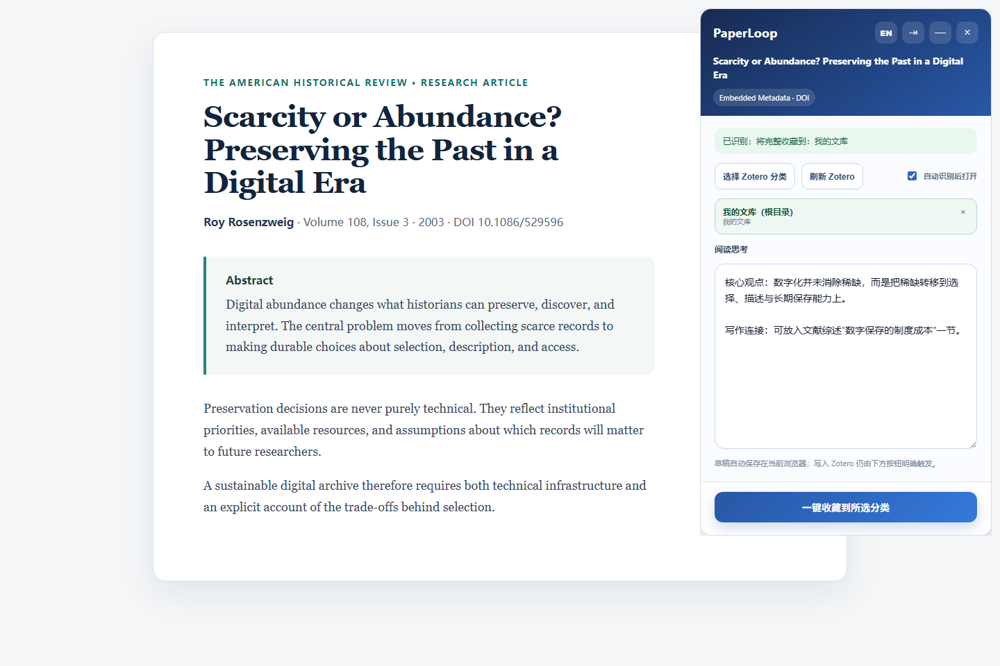

  
  

# PaperLoop

**继续阅读，随手记录，把论文和思考一起保存到 Zotero。**

PaperLoop 是一个**在 Zotero Connector 基础上修改开发**的论文阅读扩展。它保留 Zotero Connector 已有的网页识别、Translator、题录与附件采集能力，并增加常驻阅读侧栏、浏览器本地思考草稿、论文页面自动展开和一体化 Zotero 保存流程，把阅读、记录、文献入库与可持续更新的 Zotero 子笔记连接起来。

> PaperLoop 是独立维护的修改版本，不是 Zotero 官方产品，也未获得 Zotero 官方背书。

## PaperLoop 增加了什么

### 论文保持可见，边看边写

PaperLoop 侧栏常驻在论文旁边，网页仍可正常滚动。阅读过程中可以持续记录问题、理解和写作想法，不需要打开遮挡全文的弹窗，也不必切换到另一个应用。

### 把导入过程压缩为一次操作

选择 Zotero 文库和分类，写下思考，然后单击一次。PaperLoop 会协调题录采集、可用附件、分类归属和思考笔记，简化 Zotero Connector 原本分散的保存操作，并将思考同步合并到同一次操作中。

### 用浏览器草稿保护尚未同步的思考

尚未同步的文字会按论文身份保存在浏览器本地。关闭后重新打开论文页面，草稿仍可恢复。同步完成后，Zotero 是权威副本；即使浏览器关联缓存丢失，也可按 DOI 从 Zotero 恢复条目与 PaperLoop 笔记的关系。

### 识别论文页面后自动展开

开启自动展开后，当 Zotero Translator 系统确认当前页面是论文页面时，PaperLoop 会自动打开。同一标签页切换到另一篇论文会刷新侧栏，不同标签页各自保存草稿。用户可以关闭自动展开，也可以随时最小化或彻底关闭侧栏。

### 阅读侧栏可随时切换中文与英文

使用 PaperLoop 标题栏中的 `EN` / `中` 按钮，可以立即切换整个侧栏，包括识别状态、Zotero 保存位置、思考输入区、收藏反馈与恢复提示。语言偏好保存在扩展本地，切换页面、重启浏览器或原位升级后仍会保留；切换语言不会改变当前论文、草稿或 Zotero 保存位置。

## 哪些能力来自 Zotero Connector

PaperLoop 不替代 Zotero Connector 的文献提取能力，也不会根据页面视觉信息猜测残缺题录。

| 组件 | 负责内容 |
|---|---|
| **Zotero Connector 基础能力** | 使用 Zotero Translators 识别受支持的论文页面、提取题录、发现并保存支持的附件。 |
| **PaperLoop 浏览器工作流** | 提供常驻阅读侧栏、按论文隔离的浏览器草稿、自动展开、Zotero 保存位置选择、一次操作编排以及明确的成功或部分失败反馈。 |
| **PaperLoop DOI Bridge for Zotero 7** | 按 DOI 查询既有条目、在目标文库内复用条目、添加分类、更新同一条 PaperLoop 子笔记、恢复关联并支持经过验证的 PDF 补录。 |

浏览器扩展基于 [zotero/zotero-connectors](https://github.com/zotero/zotero-connectors) 开发；Zotero 桌面端集成使用 [zotero/zotero](https://github.com/zotero/zotero) 提供的 API 与数据模型。

## 从阅读到 Zotero

1. 打开一个可被 Zotero Translator 支持的论文页面。
2. PaperLoop 识别页面；若已开启自动展开，阅读侧栏会自动打开。
3. 保持论文可见和可滚动，持续编写或修改思考。
4. 选择目标 Zotero 文库与分类。
5. 单击一次，保存或复用论文，并把思考同步为该条目下的 Zotero 子笔记。
6. 以后继续补充思考时，再次同步同一条笔记。

重复点击和网络重试采用幂等处理。同一个 Zotero 文库内，已有 DOI 会复用原条目，同一条目可以加入多个分类；不同 Zotero 文库使用独立条目，因为一个 item key 不能跨文库。

## 当前版本

| 组件 | 版本 | 已验证环境 |
|---|---:|---|
| PaperLoop 浏览器扩展 | `0.3.11` | Microsoft Edge / Chromium，Manifest V3 |
| PaperLoop DOI Bridge | `0.1.19` | Zotero 7.0.x |

从 [最新 Release](https://github.com/jinkeguo/PaperLoop/releases/latest) 下载相互匹配的两个文件，然后按照[安装与验收说明](docs/INSTALLATION.md)操作。

## 可靠性边界

- 页面必须存在可用的 Zotero Translator；页面未识别时，PaperLoop 不会猜测并创建残缺条目。
- PDF 是否可用仍取决于期刊登录、机构权限、网站规则和当前浏览器会话。
- 已有条目缺少 PDF 时可以再次检查；HTML 登录页面会被拒绝，不会被当作 PDF 保存。
- 已同步的条目、附件和笔记保存在 Zotero；浏览器存储只保护草稿与恢复状态，不能替代 Zotero 同步或备份。
- 识别、收藏、去重和笔记同步不要求 Agent 或大模型 API 参与。
- 当前仍是实验性版本，浏览器端需要以开发者模式安装。

## 文档

- [安装与验收](docs/INSTALLATION.md)
- [架构](docs/ARCHITECTURE.md)
- [隐私与安全边界](docs/PRIVACY.md)
- [构建与测试](docs/BUILD_AND_TEST.md)
- [参与贡献](CONTRIBUTING.md)

## 许可证与署名

PaperLoop 基于 Zotero Connector 上游提交 `48ad1fe09defb770f83a3268cf8ebe72ab9aba52` 开发，并按 GNU Affero General Public License v3 发布。详见 [COPYING](COPYING) 与 [NOTICE.md](NOTICE.md)。
